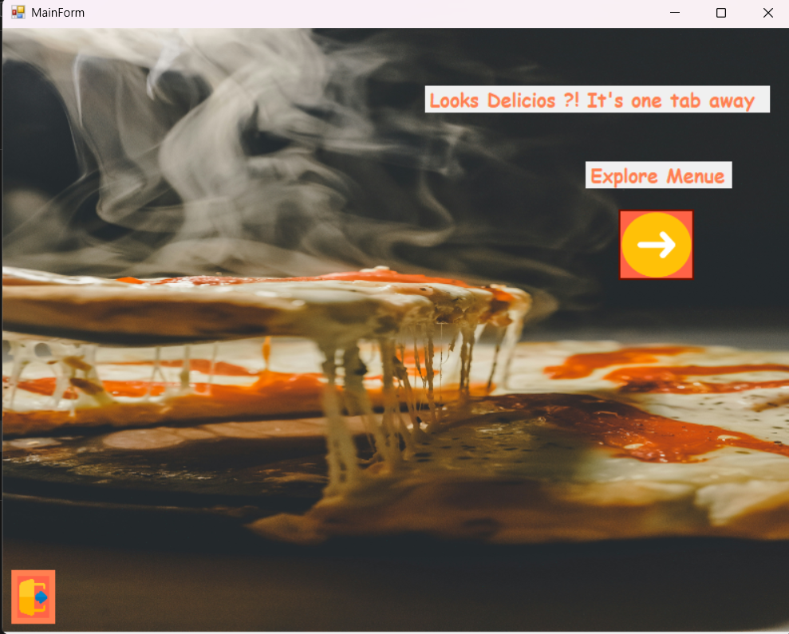
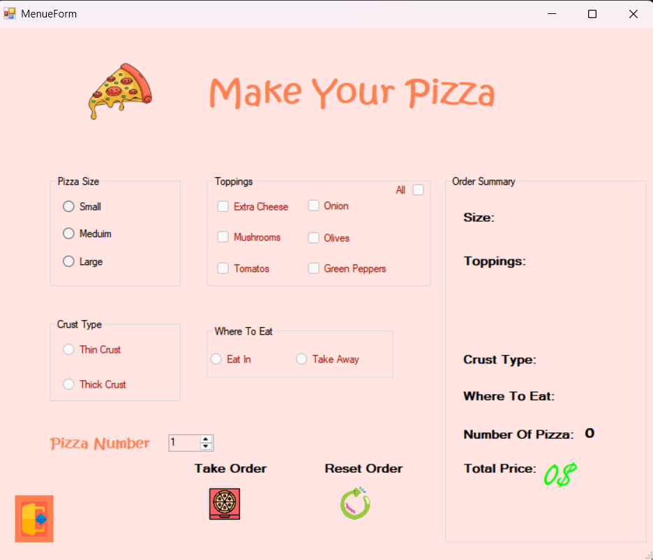
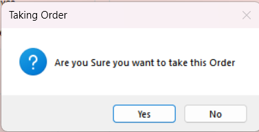
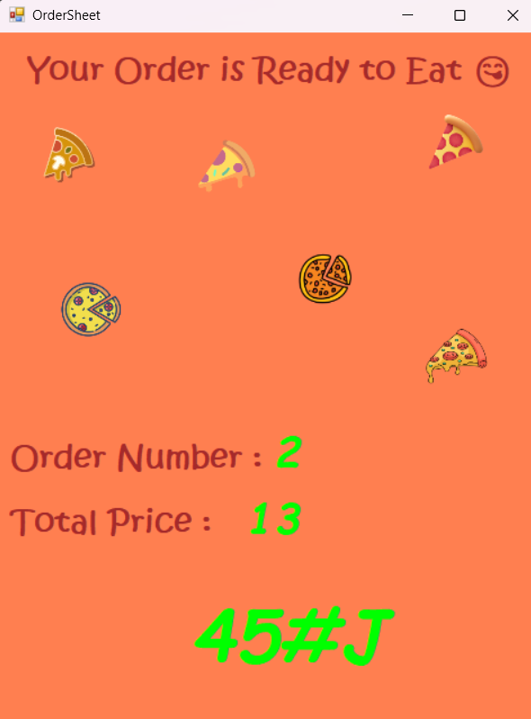

# Pizza Order 🍕

A Pizza ordering desktop application where you customize your pizza size, crust, toppings, and quantity — built with **C#** and **Windows Forms (.NET Framework)**, developed to apply the concepts learned in Dr. Mohammad Abu-Hadhoud's C# Level 1 course on [Programming Advices](https://www.programmingadvices.com).

---

## Screenshots

> Welcome screen

> Pizza customization menu

> Order confirmation dialog

> Order summary with unique order code and total price

---

## Features

- Welcoming landing screen with a "Explore Menu" button
- Choose pizza size: Small, Medium, or Large
- Choose crust type: Thin or Thick
- Select toppings: Extra Cheese, Mushrooms, Tomatoes, Onion, Olives, Green Peppers — or select All at once
- Choose where to eat: Eat In or Take Away
- Set the number of pizzas
- Live order summary panel showing all selections and total price
- Confirmation dialog before placing the order
- Order sheet showing order number, total price, and a unique generated order code

---

## How to Use

1. Click **Explore Menu** on the welcome screen
2. Select your pizza size, crust type, and toppings
3. Choose whether you want to Eat In or Take Away
4. Set the number of pizzas
5. Click **Take Order** to place your order
6. Confirm the order in the dialog
7. View your order sheet with the total price and unique order code
8. Click **Reset Order** to start a new order

---

## Tech Stack

| | |
|---|---|
| Language | C# |
| Framework | .NET Framework |
| UI | Windows Forms (WinForms) |
| IDE | Visual Studio Community |

---

## Course Info

This project was built to apply concepts from **C# Level 1** by Dr. Mohammad Abu-Hadhoud on the [Programming Advices](https://www.programmingadvices.com) platform — a course covering C# syntax, .NET Framework fundamentals, and Windows Forms desktop application development. It is one of multiple projects implemented throughout the course.

---

## Author

**Yusuf SHAABAN ARJA**
